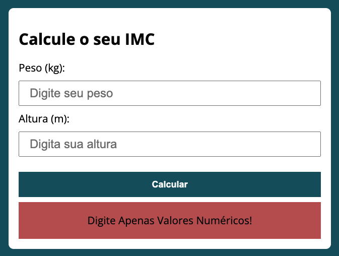
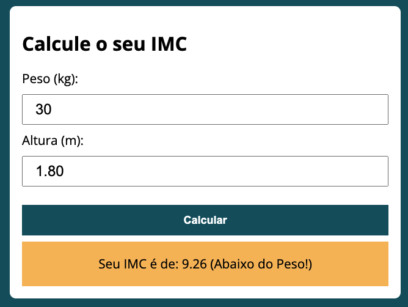
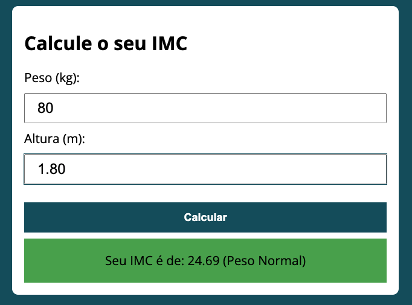
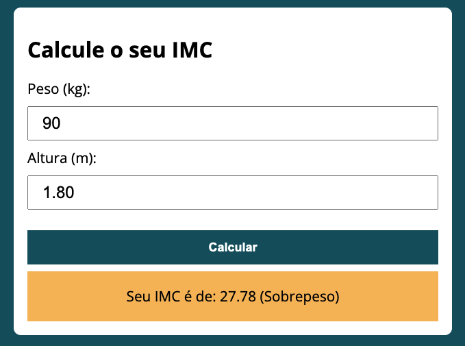
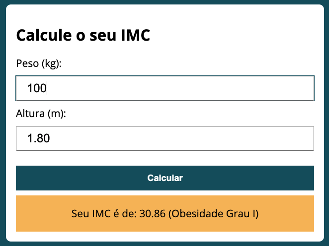
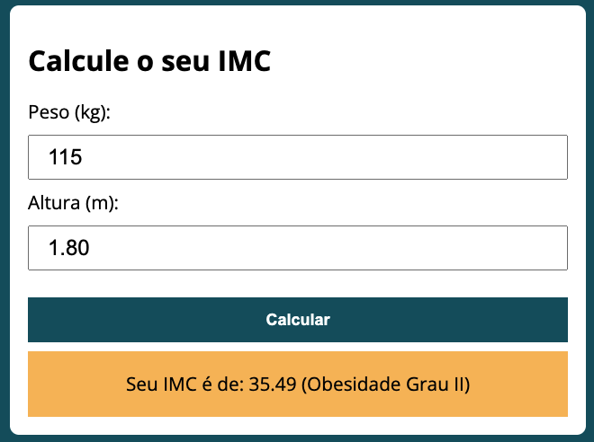
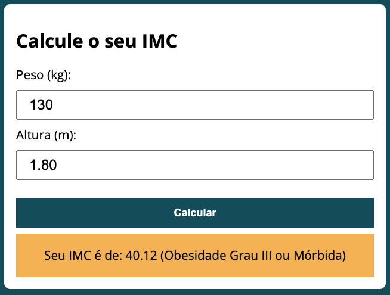

## BMI Calculator
###### by _[Italo Amaral](https://www.linkedin.com/in/italo-rockenbach-594082132/)_

### -> What is this project?
#### This project was intended to create a BMI calculator, using just a little bit of HTMl, CSS and JS.

### -> How it works?
#### First we must put our weight in KG, and our height in M, after that just click on the 'calculate' button and the system returns you if you are underweight, ideal weight, overweight, or obesity grade I, II or II.

### -> Illustrative images of how it works.

###### 1. When you enter non-numeric values, this error message appears, suggesting you enter only numeric values.

###### 2. When you are underweight, this orange alert appears warning you! And it also shows you your BMI!

###### 3. When you are at normal weight it gives you a green alert, And it also shows you your BMI!

###### 4. When you are overweight, or obese, it returns an orange alert, saying that you are overweight, or the type of obesity. And it also shows you your BMI

