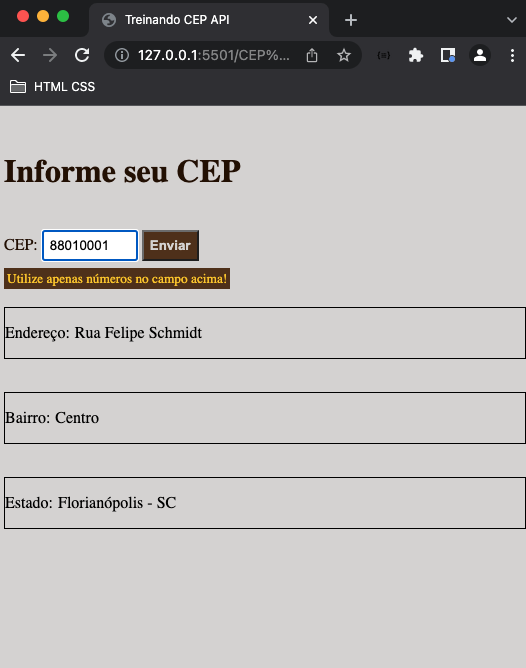
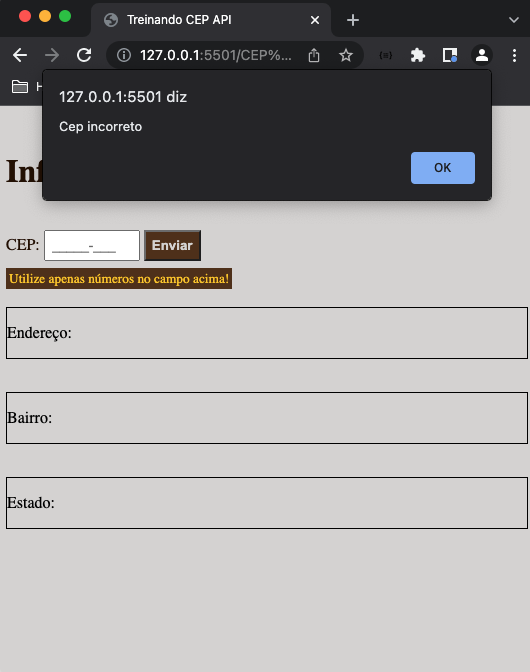

## BMI Calculator
###### by _[Italo Amaral](https://www.linkedin.com/in/italo-rockenbach-594082132/)_

### -> What is this project?
#### This mini project was intended to practice requesting information from an API and showing it in HTML. In this project VIACEP API was used.

### -> How it works?
#### We only need to inform the zip code (BR only) in the "CEP" field, and then click on search and the address, city and state will appear below.

### -> Illustrative images of how it works.

###### 1. Below is an example of how it works when you write a valid zip code

###### 2. Below is an example of what happens when we enter a zip code greater than 8 numbers, and also when we click search without typing anything.

28/03/2022
