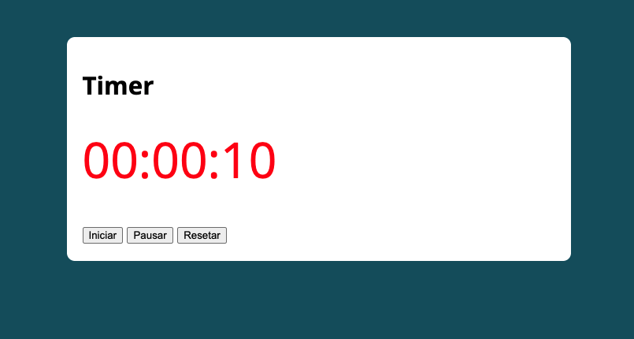

## BMI Calculator
###### by _[Italo Amaral](https://www.linkedin.com/in/italo-rockenbach-594082132/)_

### -> What is this project?
#### This mini project was intended to practice JavaScript and the "date" method to create a timer starting from 00:00:00 to 23:59:59.

### -> How it works?
#### We only need to click on 'iniciar' and if you want do pause just click on 'pausar' and if you wish to reset the timer just click on 'resetar'.

### -> Illustrative images of how it works.

###### 1. Below is an example of how it works when you click on 'iniciar'

###### 2. Below is an example of what happens when we click on 'pausar'

