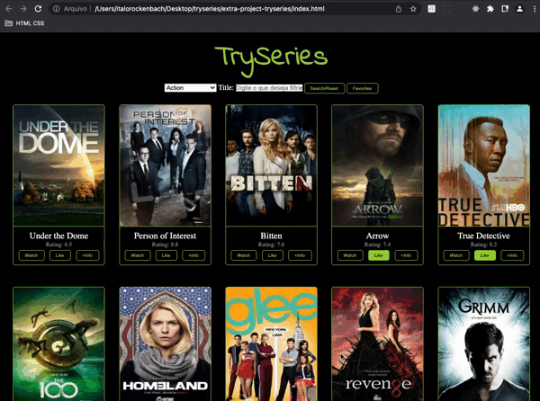

# :popcorn: TrySeries
###### by _[Italo Amaral](https://www.linkedin.com/in/italo-rockenbach-594082132/)_

## :page_with_curl: About
This was an extra project I did when I was still studying the web fundamentals module at Trybe.

I had to develop a TrySeries website fetching for series data from the _[TVMaze API.](https://www.tvmaze.com/api)_

<!-- ## :memo: Methodologies

* Mobile First
* Kanban
* Scrum -->

## :man_technologist: Developed Skills

* DOM manipulation through pure javaScript
* Fetch data from a public API

## :hammer_and_wrench: Tools

* HTML5
* CSS3
* JavaScript ES6+
* GitHub Pages

## :iphone: How it Works

